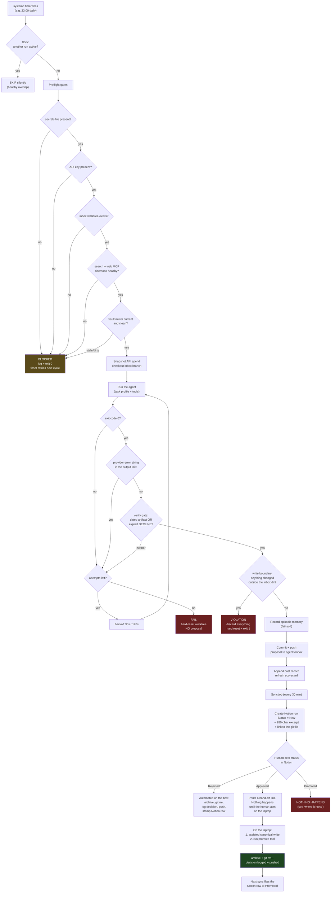

# An unattended AI agent workforce with a human approval gate — how it's wired, and where it hurts

*A description of a working system, written to be handed to other AI models and to people who
have built something similar. Client names, hostnames, repo URLs and credentials are removed.
Everything below is the real design, and the numbers are measured, not estimated.*

---

## The problem it solves

I run a consultancy. I wanted a set of AI agents that work overnight — research the market,
watch my sales pipeline, draft follow-up messages, distil notes into a knowledge base — without
me babysitting them, and **without them being able to corrupt my knowledge base**.

The core design constraint: **agents propose, humans dispose.** No agent may write to the
canonical knowledge vault. Every agent output is a *proposal* that a human promotes, edits, or
rejects. That's the whole idea, and it's also where the trouble starts.

---

## The pieces

| Component | What it is |
|---|---|
| **The box** | An always-on Linux machine running the agent fleet. Reached over a private VPN. |
| **The vault** | An Obsidian markdown knowledge base — the canonical memory. Lives on my laptop. |
| **The mirror** | A de-identified read-only copy of the vault on the box, so agents can read but never write canon. |
| **The inbox branch** | A dedicated git branch (`agents/inbox`) where every proposal lands as one dated markdown file. |
| **Notion** | The review surface — one database row per proposal, where I set status. |
| **systemd timers** | The scheduler. ~14 jobs, each a timer + service pair. No cron. |
| **A shared runner** | One hardened bash wrapper (~400 lines) that every scheduled agent job goes through. |
| **A local search daemon** | An MCP server indexing the ~470-document vault mirror, so agents retrieve rather than guess. |

Agents are headless CLI coding agents (Claude Code, in `--print` mode) plus a few on a hosted
model router. Model choice is pinned per job to a **full model name, never an alias** — an alias
silently rolls forward on the next release and changes your results with no diff.

---

## The flow, start to end

---

## The gates, and why each one exists

Every one of these was added after a specific failure. That's worth saying: none of them were
designed up front.

**1. Global mutex (`flock`).** All scheduled jobs share one lock. Two agents editing the same
git worktree concurrently corrupts it. A collision exits silently — it's normal timer overlap,
not an error. *Trap: this means a job can be silently skipped, so the schedule has deliberate
30-minute spacing between chained jobs.*

**2. Preflight blocks.** Missing secrets, missing API key, missing worktree, dead search daemon,
dead web-search daemon, stale or dirty vault mirror. Each exits **0**, not non-zero — "blocked"
is a valid state, not a crash; the timer simply retries. But it's recorded as `BLOCKED`, so it
never masquerades as "the agent had nothing to say."

**3. Mirror freshness gate.** A single script owns the question "is the local vault copy
current?" If the mirror is stale or has uncommitted changes, the run refuses. **A confidently
wrong briefing built on a five-day-old vault is worse than no briefing.** This was added after a
force-push upstream permanently wedged the mirror and the agents kept cheerfully reporting on a
three-day-old world for 14 hours.

**4. Retry with backoff.** Three attempts, 30s then 120s. Nothing exotic.

**5. Provider-error scan.** Greps the *tail of this attempt's own output* for HTTP 4xx/5xx and
empty-stream signatures. Exists because a model provider returned HTTP 402 "insufficient
credits" that got written to a profile's side log instead of stdout — so the run exited **0**
with no output, and logged as a clean "agent produced no proposal" **for eight consecutive
days**. Nobody noticed. This is the single most valuable gate in the system.

**6. The verify gate — the important one.** A run is only legitimate if it produced *either* a
dated artifact newer than this run's start timestamp, *or* an explicit `DECLINE:` sentinel in
its log. **Silence is not success.** Anything else fails the attempt and retries.

This generalises: *any unattended agent job needs a positive artifact assertion, not an exit
code.* Exit 0 means "the process ended", not "the work happened".

**7. Write boundary.** After the run, `git status` is diffed. If the agent touched *anything*
outside its one permitted directory, the entire run is discarded with a hard reset. Not warned —
discarded. The agent has full tool access inside the sandbox, and zero blast radius outside it.

**8. Cost accounting.** Real spend per run, computed as (cumulative API spend after) − (before),
appended as a structured key=value record. Written on failures and violations too, so a runaway
failure loop is visible rather than invisible.

**9. The human gate.** The box holds no credential to the canonical vault. Not "shouldn't write"
— *cannot*. It also holds no outward credentials at all: no email, no social, no messaging. Every
outward artifact is a draft a human sends.

---

## Where it hurts — the honest part

This is the bit I actually want feedback on. The pipeline is reliable. **The review loop is not.**

### 1. One lifecycle is serving three different kinds of output

Everything lands in the same approval queue with the same `New → Approved → Promoted` states.
But the jobs emit three incompatible things:

| Kind | Example | Is "promote" meaningful? |
|---|---|---|
| **Vault proposals** | A researched reference doc | Yes |
| **Send material** | Ready-to-send follow-up drafts | **No** — it's a message, not a knowledge change |
| **State reports** | "5 deals have gone quiet" | **No** — it's a dashboard reading |

Roughly **half my open queue can never be promoted by construction.** The report generator even
writes "Proposed vault change: None — flag only" in its own body, then lands in the approval
queue anyway. I'm being asked to approve things that have no approve action.

### 2. Recurring jobs re-emit unchanged state as new decisions

A nightly job re-reports the same situation every night. Two of my open items are **byte-identical
except the date stamp and the arithmetic** — same entities, same evidence, 2429 bytes each, four
days apart. The follow-up drafter even has a "Carried" section that says *"no deal in either list
has moved."* It knows.

Because nothing supersedes anything, four nightly snapshots of one unchanged fact become **four
separate decisions** sitting in my queue with equal standing. There is no supersession rule.

### 3. A status I can set that silently does nothing

The Notion status field offers four values. The automation reads **two** of them. Setting
`Rejected` triggers a full automated cleanup. Setting `Approved` prints a hand-off note. Setting
`Promoted` — which is the one that *sounds* like the happy path — **is read by nothing at all.**
The row turns green, the file stays in the queue forever, the decision log gets no entry, and
nothing reaches the vault.

I did this 15 times before noticing. The decision log's last entry is 12 days old. Some of those
"promoted" items did land in the vault; some didn't; **nothing on the system records which.**

Generalisable lesson: **if a UI lets a human set a state the automation doesn't consume, that's
not a missing feature — it's a silent data-corruption path.**

### 4. "Pending" is defined in two places and they've diverged

A backlog alarm counts *files on disk*. The review surface tracks *status in a database*. They
disagree by 15 items, so the alarm has been reporting "36 pending, oldest 22 days" every morning
regardless of anything I do. An alert that cannot be silenced by doing the right thing is an
alert you stop reading — which defeats the point of having built it.

### 5. The review surface doesn't contain the thing being reviewed

The sync writes a **280-character excerpt** and a link to the file on GitHub. That's it. My open
queue is ~470 KB of markdown; the review surface holds about 6 KB of it. Individual research
documents run 27–33 KB. So "reviewing" means: open database, find buried link, leave for GitHub,
read raw markdown, come back, set a status. Every single time.

**The review surface should hold the artifact. Mine holds a footnote pointing at the artifact.**

---

## What I think the fix is

1. **Write the full document into the review surface.** Make the place I decide, the place I read.
2. **Split the three output classes to three destinations.** Proposals get an approval queue.
   Reports get a *single row updated in place* — one live dashboard, not a daily archive.
   Send material gets a send queue whose verb is sent/not-sent.
3. **Add supersession.** When a recurring stream emits a new item, the previous unactioned one
   from that stream auto-closes as `Superseded`. In my case this alone takes 21 open items to ~8.
4. **Delete or automate the dead status.** Either the automation consumes it, or humans can't set it.
5. **One definition of "pending".** The alarm and the queue must read the same source.

---

## The questions I'd like answered

- Is proposal-per-file-per-night the wrong primitive entirely? Should recurring agents maintain
  **one living document** they revise, rather than emitting a new artifact each run?
- How do you make an approval queue that *degrades gracefully* when the human falls behind? Mine
  degrades by accumulating until it's unreadable — which is the worst possible failure mode,
  because the backlog itself becomes the reason not to engage.
- Is the human approval gate on **knowledge writes** even the right gate? It was designed to
  protect quality. In practice the vault is starved while the queue is drowning. Perhaps the gate
  belongs on *outward* actions only, with knowledge writes reversible-by-default instead
  (everything is git — every write is already revertible).
- Does anyone have a working pattern for **"this proposal supersedes that one"** in an agent
  pipeline, rather than treating every run as an independent event?

---

*Happy to go deeper on any layer — the runner's gate sequence, the git membrane, the cost
accounting, or the retrieval setup.*
